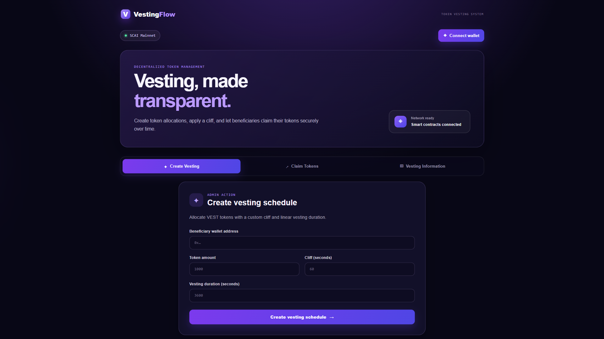
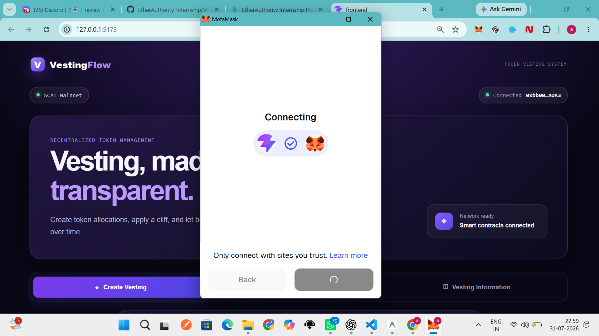
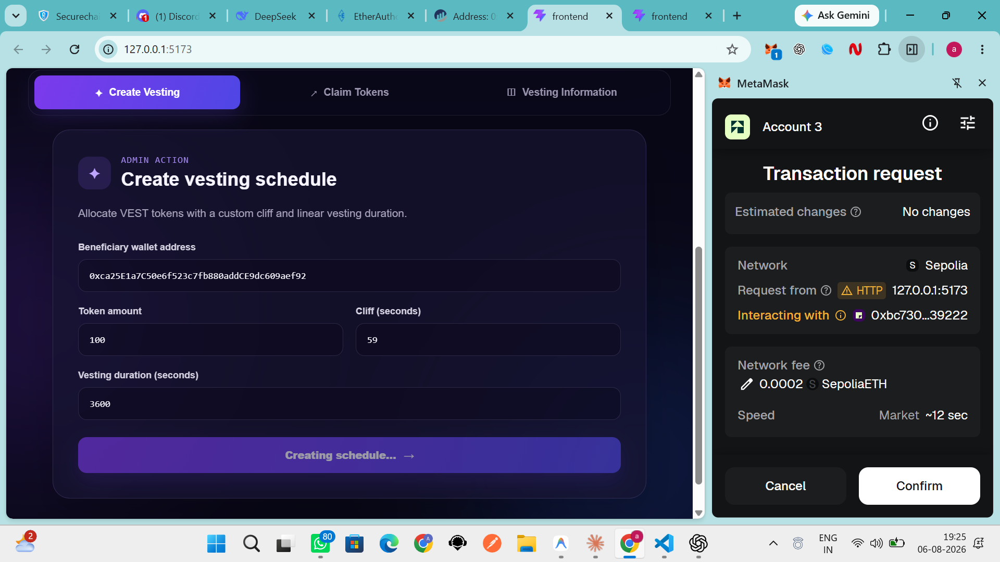
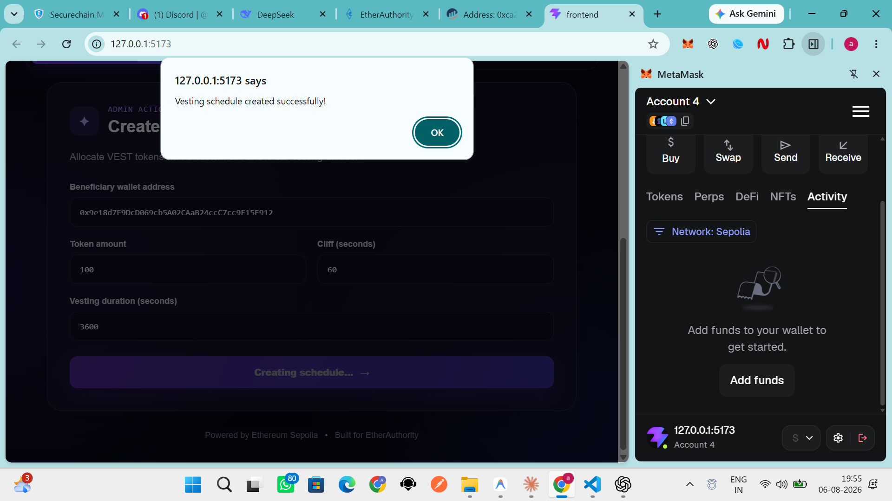
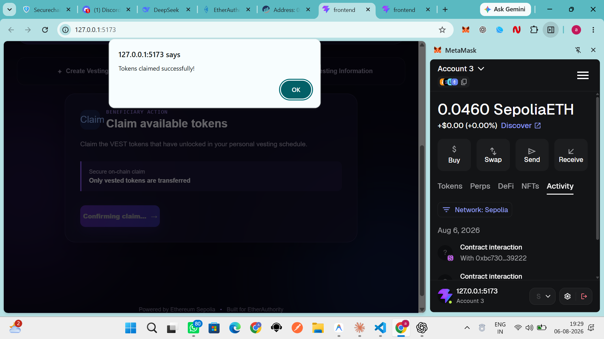
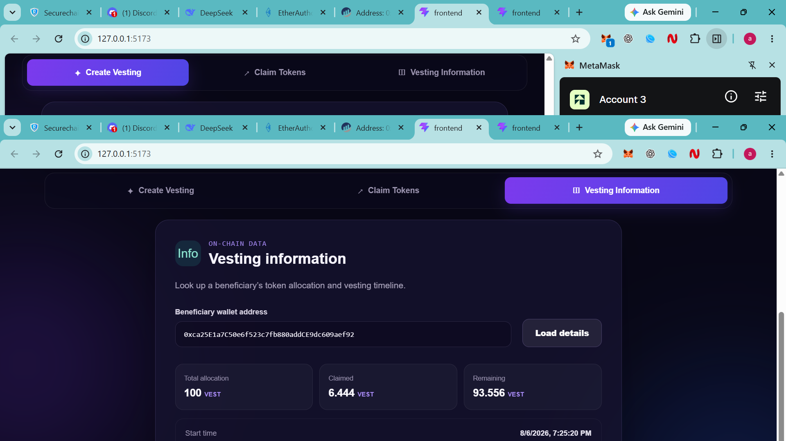

# 🚀 Token Vesting System

<div align="center">


</div>

---

# 📖 Project Overview

The **Token Vesting System** is a decentralized blockchain application (DApp) developed as part of the **EtherAuthority Web3 Internship**.

The project enables secure and transparent distribution of ERC-20 tokens through configurable vesting schedules. Instead of releasing tokens immediately, the system locks tokens and gradually releases them over time based on predefined vesting conditions.

The application consists of Solidity smart contracts deployed on the **SCAI Mainnet**, a React frontend integrated with **Ethers.js**, and MetaMask wallet connectivity.

---

# 🎯 Objectives

- Develop secure Solidity smart contracts.
- Integrate React frontend with Web3.
- Connect MetaMask wallet.
- Deploy contracts on SCAI Mainnet.
- Perform unit testing.
- Implement security validations.
- Optimize gas usage.
- Build a complete decentralized application.

---

# ✨ Features

- 🔐 ERC20 Vesting Token
- 📅 Create Vesting Schedule
- ⏳ Cliff-based Vesting
- 📈 Linear Token Release
- 💰 Claim Vested Tokens
- 👛 MetaMask Wallet Integration
- ⚡ React + Ethers.js Frontend
- 🌐 SCAI Mainnet Deployment
- 🧪 Hardhat Testing
- 🔒 OpenZeppelin Security
- 📊 Real-Time Vesting Information

---

# 🛠 Technology Stack

## Smart Contracts

- Solidity ^0.8.24
- OpenZeppelin Contracts

## Blockchain

- SecureChain AI (SCAI) Mainnet

## Development

- Hardhat
- Node.js
- npm

## Frontend

- React.js
- Vite
- JavaScript
- CSS

## Web3

- Ethers.js
- MetaMask

---

# 📂 Project Structure

```text
Week4/
│
├── contracts/
│   ├── VestingToken.sol
│   └── TokenVesting.sol
│
├── scripts/
│   └── deploy.js
│
├── test/
│   └── TokenVesting.test.js
│
├── frontend/
│   ├── public/
│   ├── src/
│   │
│   ├── components/
│   │   ├── WalletConnect.jsx
│   │   ├── CreateVesting.jsx
│   │   ├── ClaimTokens.jsx
│   │   ├── VestingInfo.jsx
│   │   └── Navbar.jsx
│   │
│   ├── contracts/
│   │   ├── abi.js
│   │   └── addresses.js
│   │
│   ├── App.jsx
│   └── main.jsx
│
├── hardhat.config.js
├── package.json
└── README.md
```

---

# 🏗 Project Architecture

```text
                User
                  │
                  ▼
        React Frontend (Vite)
                  │
                  ▼
              Ethers.js
                  │
                  ▼
             MetaMask Wallet
                  │
                  ▼
        SecureChain AI Mainnet
                  │
        ┌─────────┴─────────┐
        ▼                   ▼
TokenVesting.sol     VestingToken.sol
```

---

# ⚙ Smart Contract Development

Two Solidity smart contracts were developed.

## 1️⃣ VestingToken.sol

ERC20 token contract responsible for creating and managing vesting tokens.

### Features

- ERC20 Standard Token
- Mint Tokens
- Owner Controlled Minting
- OpenZeppelin ERC20
- Ownable Access Control

---

## 2️⃣ TokenVesting.sol

Main vesting smart contract.

### Features

- Create Vesting Schedule
- Store Beneficiary Details
- Linear Vesting Calculation
- Cliff Period
- Claim Vested Tokens
- Owner-only Schedule Creation

---

# 💻 Frontend Integration (React + Web3)

The frontend was developed using **React.js** and **Ethers.js** to interact with the deployed smart contracts.

### Functionalities

- Connect MetaMask Wallet
- Create Vesting Schedule
- Claim Tokens
- Display Vesting Information
- Real-Time Blockchain Interaction

---

# 👛 Wallet Connection Integration

The DApp integrates MetaMask for blockchain interaction.

### Supported Features

- Connect Wallet
- Detect Connected Account
- Transaction Signing
- Smart Contract Interaction
- Network Detection

---

# 🌐 Blockchain Network Integration

The application is deployed on **SecureChain AI (SCAI) Mainnet**.

### Network Details

- Network: SecureChain AI Mainnet
- Chain ID: 34
- Currency: SCAI

### Integrated Using

- Ethers.js
- MetaMask
- Solidity Smart Contracts

---

# 📜 Smart Contract Addresses

## VestingToken

```text
0x92FF117C1E2E1a0273d03408Fc65310f184B3699
```

## TokenVesting

```text
0xa7bE545ca629a3cE6A79c4b121025d18B19f6D01
```

---

# 📦 Installation

Clone Repository

```bash
git clone https://github.com/anuragreddy23-dot/EtherAuthority-Internship
```

Install Dependencies

```bash
npm install
```

Compile Contracts

```bash
npx hardhat compile
```

Deploy Contracts

```bash
npx hardhat run scripts/deploy.js --network scai
```

Run Frontend

```bash
cd frontend

npm install

npm run dev
```

---

# ▶ Running the Project

### Start Hardhat

```bash
npx hardhat compile
```

### Deploy Contracts

```bash
npx hardhat run scripts/deploy.js --network scai
```

### Start React Application

```bash
cd frontend

npm run dev
```

Open:

```
http://localhost:5173
```
---

# 🧪 Smart Contract Unit Testing

The smart contracts were thoroughly tested using the **Hardhat Testing Framework** to ensure correct functionality and reliability.

### Unit Test Cases

- ✅ Smart Contract Deployment
- ✅ Token Contract Deployment
- ✅ Vesting Contract Deployment
- ✅ Create Vesting Schedule
- ✅ Store Beneficiary Information
- ✅ Claim Tokens Successfully
- ✅ Reject Claim Before Cliff
- ✅ Validate Token Transfers

### Run Tests

```bash
npx hardhat test
```

---

# 🔒 Security & Edge-Case Testing

Security was considered throughout the development process by using OpenZeppelin contracts and validating multiple edge cases.

### Security Checks

- ✅ Only Owner can create vesting schedules.
- ✅ Unauthorized users cannot perform admin operations.
- ✅ Claim before cliff period is rejected.
- ✅ Duplicate vesting schedules are prevented.
- ✅ Zero token amount validation.
- ✅ Invalid beneficiary address validation.
- ✅ Safe ERC20 token transfers.
- ✅ Ownership protection using OpenZeppelin Ownable.
- ✅ Overflow and Underflow protection using Solidity ^0.8.x.

### Edge Cases Tested

- Vesting creation with invalid parameters.
- Claiming before vesting starts.
- Claiming multiple times.
- Empty beneficiary validation.
- Invalid token transfers.

---

# ⛽ Gas Optimization & Performance

Several optimizations were implemented to improve contract performance and reduce gas consumption.

### Optimizations

- Solidity **0.8.24** built-in overflow protection.
- OpenZeppelin audited smart contracts.
- Mapping-based storage for O(1) lookup.
- Efficient state variable usage.
- Minimal storage writes.
- Constructor initialization.
- Reusable contract functions.
- Optimized ERC20 transfer logic.

### Performance Validation

- Successfully deployed on SCAI Mainnet.
- Successfully created vesting schedules.
- Successfully claimed vested tokens.
- Frontend interaction completed successfully.

---

# 🚀 Mainnet Deployment

The smart contracts were successfully deployed on the **SecureChain AI (SCAI) Mainnet**.

### Network Details

| Property | Value |
|----------|-------|
| Network | SecureChain AI Mainnet |
| Chain ID | 34 |
| Currency | SCAI |

---

# 🌍 Live Deployment

### Smart Contract Addresses

#### VestingToken

```text
0x92FF117C1E2E1a0273d03408Fc65310f184B3699
```

#### TokenVesting

```text
0xa7bE545ca629a3cE6A79c4b121025d18B19f6D01
```

---

# 💻 Frontend Deployment

The frontend application is deployed using **Vercel**.

### Live URL

```text
https://YOUR-PROJECT.vercel.app
```


---

# 📚 Project Workflow

```
User
   │
   ▼
Connect MetaMask Wallet
   │
   ▼
Create Vesting Schedule
   │
   ▼
Store Vesting Data on Blockchain
   │
   ▼
Wait Until Cliff Period
   │
   ▼
Claim Vested Tokens
   │
   ▼
View Updated Vesting Information
```

---

# 📷 Project Screenshots

Create a folder named:

```
docs/screenshots/
```

Store all screenshots inside it.

---

## 🏠 Home Page

```
docs/screenshots/home.png
```

```md

```

---

## 👛 Wallet Connected

```
docs/screenshots/wallet-connected.png
```

```md

```

---

## 📅 Create Vesting Schedule

```
docs/screenshots/create-vesting.png
```

```md

```

---

## ✅ Vesting Created Successfully

```
docs/screenshots/vesting-created.png
```

```md

```

---

## 💰 Claim Tokens

```
docs/screenshots/claim-tokens.png
```

```md

```

---

## 📊 Vesting Information

```
docs/screenshots/vesting-info.png
```

```md

```

---

## 🌐 SCAI Mainnet Deployment


```
docs/screenshots/scai-deployment.png
```

```md

```

---

# 🎥 Demo Video

Record a short demo covering:

- Wallet Connection
- Create Vesting Schedule
- Claim Tokens
- Vesting Information
- Successful Transaction

### Demo Video Link

```text
https://YOUR_VIDEO_LINK
```

---

# 📋 Internship Requirements Completed

| Requirement | Status |
|------------|--------|
| Smart Contract Development | ✅ Completed |
| Frontend Integration | ✅ Completed |
| Wallet Connection Integration | ✅ Completed |
| Blockchain Network Integration | ✅ Completed |
| Smart Contract Unit Testing | ✅ Completed |
| Security & Edge-Case Testing | ✅ Completed |
| Gas Optimization & Performance | ✅ Completed |
| Mainnet Deployment | ✅ Completed |
| GitHub Publication | ✅ Completed |
| Documentation | ✅ Completed |
| Demo Video | ✅ Completed *(Add Link)* |
| Vercel Deployment | ✅ Completed *(Add Link)* |

---

# 🔮 Future Improvements

- Multiple Vesting Schedules
- Revocable Vesting
- Monthly Unlock Support
- Token Dashboard
- Admin Analytics
- WalletConnect Integration
- Mobile Responsive Design
- Event History
- Multi-token Vesting
- Role-based Access Control

---

# 👨‍💻 Author

**Mothe Anurag Reddy**

B.Tech Computer Science & Engineering

Sreenidhi Institute of Science and Technology

EtherAuthority Web3 Internship

GitHub: https://github.com/anuragreddy23-dot

LinkedIn: https://www.linkedin.com/in/anuragreddy-mothe-21a699329

---

# 🙏 Acknowledgements

Special thanks to:

- EtherAuthority
- SecureChain AI
- OpenZeppelin
- Hardhat
- React
- Ethers.js

for providing the tools, frameworks, and learning resources used in this project.

---

# 📄 License

This project was developed as part of the **EtherAuthority Web3 Internship Program** for educational and learning purposes.

Licensed under the **MIT License**.
